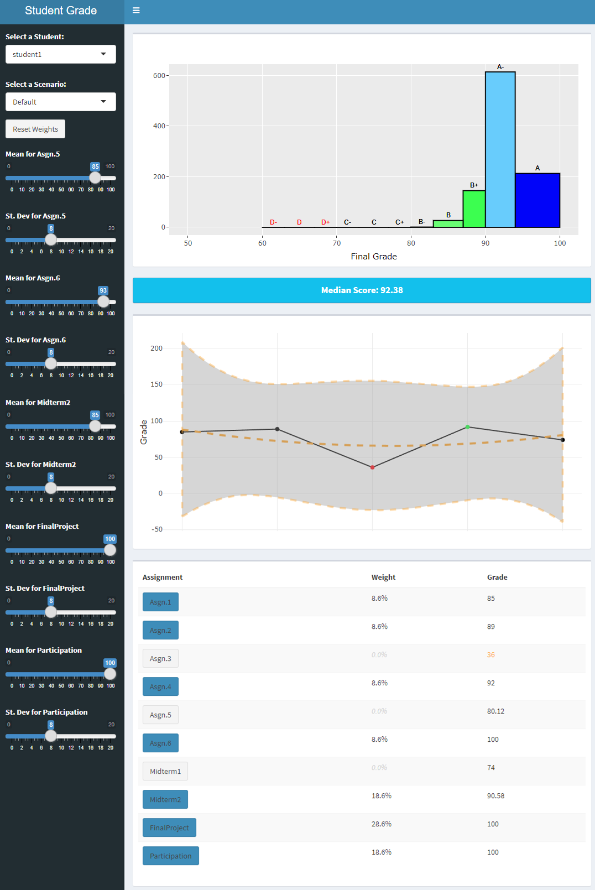

# Grade Simulator

## Introduction
Over my career, I've found that many Learning Management Systems (LMS) solutions fall short in providing detailed, customizable insights into student performance. To bridge this gap, I've developed the "Grade Simulator" - a tool that's not just for my fellow educators but also a valuable asset for students seeking a deeper understanding of their academic performance.

**Please note:** This is the initial draft of the "Grade Simulator." Enhancements and updates will be rolled out in the coming months to further refine and expand its capabilities.

## Functionality
The Grade Simulator is an R-based tool designed to simulate grade outcomes under various distribution assumptions. It offers unique features such as:
- **Grade Simulation:** Utilizing different statistical distributions, the simulator projects potential grade outcomes. This allows for a comprehensive view of how grades could vary under different scenarios.
- **Waive Functionality:** Educators can experiment by waiving certain assignments, observing the impact on overall grades, and thereby understanding the weightage and significance of different assessments.

## How It Works
- Download `grade-simulator.R` to run the application locally on your machine.
- The application uses two key datasets: `grades.csv` for student grades and `weights.csv` for the weights of different assignments.
- Upon launching the app, you'll be greeted with an intuitive user interface where you can select different scenarios, adjust parameters, and view the simulated outcomes.

## Screenshot

*The screenshot demonstrates the user interface of the Grade Simulator.*

## For Students and Educators
This analytical tool is specifically designed for both students and educators to provide a clearer, faster insight into academic performance dynamics. It's designed to streamline grade analysis, making it more intuitive and insightful, and will gradually include additional functionalities to aid in identifying potential areas for improvement and the relationships between various academic abilities.

## Upcoming Features
Stay tuned for upcoming updates that will include additional features and enhancements to the user experience.

## Feedback and Contributions
I encourage students, educators, and fellow developers to use this tool and provide feedback. Your insights are invaluable in making the Grade Simulator a more robust and user-friendly application. Feel free to raise issues, suggest features, or contribute to the code.
